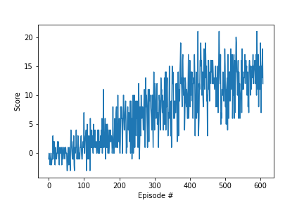

# Project 1: Navigation

## Problem statement

For this project, you will train an agent to navigate (and collect bananas!) in a large, square world.

![Trained Agent][image1]

A reward of +1 is provided for collecting a yellow banana, and a reward of -1 is provided for collecting a blue banana. Thus, the goal of your agent is to collect as many yellow bananas as possible while avoiding blue bananas.

The state space has 37 dimensions and contains the agent's velocity, along with ray-based perception of objects around agent's forward direction. Given this information, the agent has to learn how to best select actions. Four discrete actions are available, corresponding to:

- **`0`** - move forward.
- **`1`** - move backward.
- **`2`** - turn left.
- **`3`** - turn right.

The task is episodic, and in order to solve the environment, your agent must get an average score of +13 over 100 consecutive episodes.


## Installation instructions
- make sure you have anaconda installed - https://docs.anaconda.com/anaconda/install/. 
- then run this command to create banana-navigation environment:
  ```conda env create -f environment.yml```
- activate the environment: ```conda activate banana-navigation```  
- install the jupyter kernel: ```ipython kernel install --name "banana-navigation" --user```

## How to run this code
- Launch jupyter notebook from the ```banana-navigation``` folder:
  ```jupyter lab```
- Open ```Navigation.ipynb``` file and set banana-navigation as your kernel. 
- Run through each of the code cells. (shift + enter)

## Solution and Implementation Details:

- The model is implemented as a simple DQN network.

  - Fully connected Deep Network with relu activations except the (last) output layer.
  - hidden layers are of dimensions: 128,256,256
  - Input dimensions is 37 (state dimensions).
  - Output dimensions is 4 (number of actions)

- Hyperparams:

  - eps_start=1.0
  - eps_end=0.001
  - eps_decay=0.995
  - BUFFER_SIZE = int(1e5) # replay buffer size
  - BATCH_SIZE = 64 # minibatch size
  - GAMMA = 0.99 # discount factor
  - TAU = 1e-3 # for soft update of target parameters
  - LR = 5e-4 # learning rate
  - UPDATE_EVERY = 4 # how often to update the network

- The environment is solved in 508 episodes.

- Scores vs Number of episodes plot:

  - 

## Future Improvement Ideas
Some ideas to explore to improve upon the current implementation.
* Explore Prioritized Experience Replay. 
* Implement a model based on CNNs which can take the pixelated input and produce the action probabilities.
Hopefully by end of the course, will add some more ideas to this list. 

[//]: # "Image References"
[image1]: https://user-images.githubusercontent.com/10624937/42135619-d90f2f28-7d12-11e8-8823-82b970a54d7e.gif "Trained Agent"
