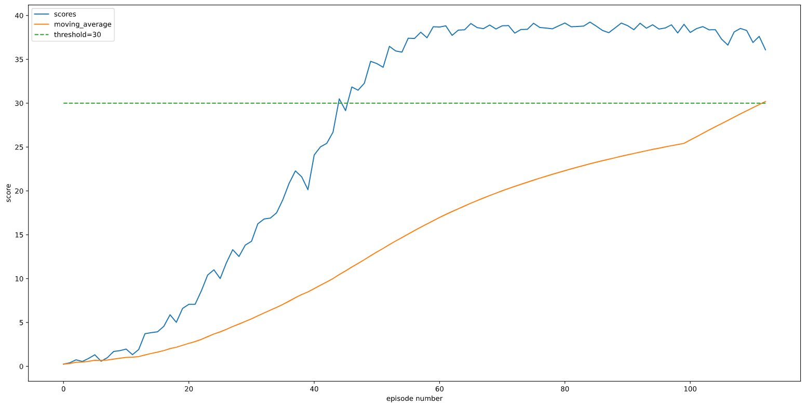

## Implementation Details
- For this problem, we chose an implementation outlined in the paper Continuous Control with Deep Reinforcement Learning. The Algorithm is called DDPG (Deep Deterministic Policy Gradient). It is an off policy algorithm, that can be used for continous action spaces. 

DDPG Highlights: 
- Uses Actor with Target Network and Critic with target network to learn. 
- Uses Ornstein-Uhlenbeck process to generate noise which is then added to the actions at each time step. The noise generated in this process is correllated with the state (previously generated noise) and is not random. 

## Learning Algorithm and Hyper Parameters
- The DDPG Agent has the following components (implementd in ddpg_agent.py): 
    - Replay Buffer
    - actor_local & actor_target networks
    - critic_local & critic_target networks
    - optimizers for actor and critic networks. 
    - OU-Noise generator. 

- Network structures:
    - Actor: has two fully connected layers wih 256 and 128 dimensions. After the first layer, the outputs of the first layer go through batch normalization. The activation functions used are leaky_relu functions. 
    - Critic: has again two fully connected layers with 256 and 128 dimensions. The Critic takes (state,action) to provide the Q values. The action values are added to the network in the second layer. 

 - Paramters: 
    - BUFFER_SIZE = int(1e6)  # replay buffer size
    - BATCH_SIZE = 128        # minibatch size
    - GAMMA = 0.99            # discount factor
    - TAU = 1e-3              # for soft update of target       - parameters
    - LR_ACTOR = 1e-3         # learning rate of the actor
    - LR_CRITIC = 1e-3        # learning rate of the critic
    - WEIGHT_DECAY = 0.0  # 0.000001  # L2 weight decay
    - LEARN_EVERY = 5
    - EPSILON = 1.0
    - EPSILON_DECAY = 0.000001
    - TRAIN_STEPS = 10
    - OUNoise: mu = 0, theta = 0.15, sigma = 0.2

## Plot of Rewards
- Number of episodes needed to reach an average score of 30 over last 100 episodes = 100. 
- 

## Future Work
- A3C, PPO, Prioritized Replay