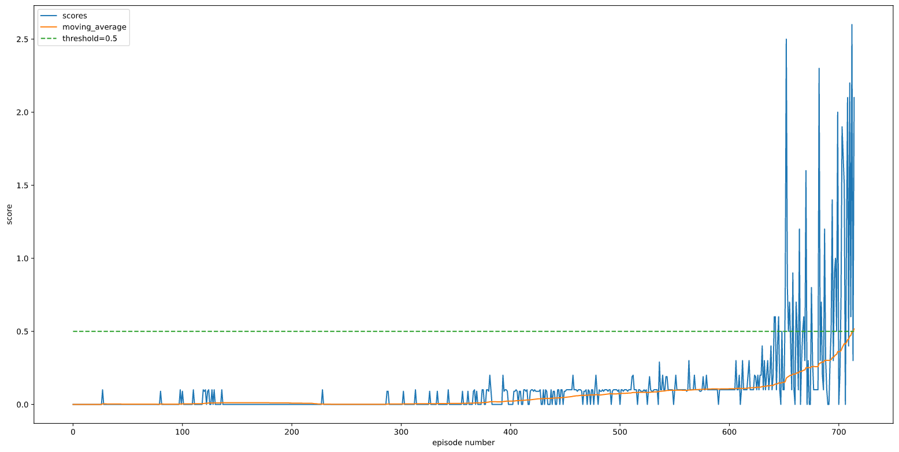

[//]: # (Image References)

[image1]: https://openai.com/content/images/2017/06/nipsdiagram_2.gif "MADDPG training and execution setting"

## Implementation Details

### MADDPG details 
MADDPG extends the DDPG algorithm. Common RL approaches in a multi agent setting have to struggle to learn to predict not only it's actions but also of the other agents to be successful. This problem appears to be more severe in the competitive situations. This problem is solved in the MADDPG framework of centralized training with decentralized execution.  The framework allows sharing of all the agents observations and actions during training and the sharing can disabled during the execution time. In this implemetation, we share a common replay buffer for training all the agents. The actors (in the Agents) still base their actions on their local observations, however during the training phase the critics will have access to all the peers states and actions leading them to be more accurate in the multi agent environment.

![MADDPG training and execution setting][image1]

The DDPG algorithm has the following features (just for reference)
- Is an off policy algorithm designed for continuos actions spaces. 
- The Algorithm concurrently learns a policy and a Q function. 
- The Algorithm also employs target networks, namely Actor with Target Network and Critic with target network to learn. 
- In order to make the DDPG policies to explore better, the algorithm also uses Ornstein-Uhlenbeck process to generate noise which is then added to the actions at each time step. 
    - One characteristic of the the noise generated in this process is that it is correllated with the state (previously generated noise) and is not random. 

The solution is mostly from the Baseline implemetation notes provided in the course. The following tips really helped in reaching the scores faster. 
- Gradient clipping for the critic. 
- invoke train for every 5 steps and train for 10 batches.   

## Learning Algorithm and Hyper paramters
- The MADDPG has the following components (implementd in ddpg_agent.py): 
    - Shared Replay Buffer between all the agents 
    - Agents and each agent is composed of 
        - actor_local & actor_target networks
        - critic_local & critic_target networks
        - optimizers for actor and critic networks. 
        - OU-Noise generator. 

- Network structures(implemented in model.py):
    - Actor: has two fully connected layers wih 256 and 128 dimensions. The activation functions used are leaky_relu functions. 
    - Critic: has again two fully connected layers with 256 and 128 dimensions. The Critic takes (state,action) to provide the Q values. The action values are added to the network in the second layer. 

 - Paramters: 
    - BUFFER_SIZE = int(1e6)  # replay buffer size
    - BATCH_SIZE = 128        # minibatch size
    - GAMMA = 0.99            # discount factor
    - TAU = 1e-3              # for soft update of target       - parameters
    - LR_ACTOR = 1e-3         # learning rate of the actor
    - LR_CRITIC = 1e-3        # learning rate of the critic
    - WEIGHT_DECAY = 0.0  # 0.000001  # L2 weight decay
    - LEARN_EVERY = 5
    - EPSILON = 1.0
    - EPSILON_DECAY = 0.000001
    - TRAIN_STEPS = 10
    - OUNoise: mu = 0, theta = 0.15, sigma = 0.2

## Plot of Rewards
- Number of episodes needed to reach an average score of 0.5 over last 100 episodes = 715.
- 

## Future Work
- Solving the soccer environment.
- Explore Asynchronous Methods for Deep Reinforcement Learning.
- Implement Proximal Policy Optimization (PPO) methods. 
- Implement Prioritized Replay buffer. 